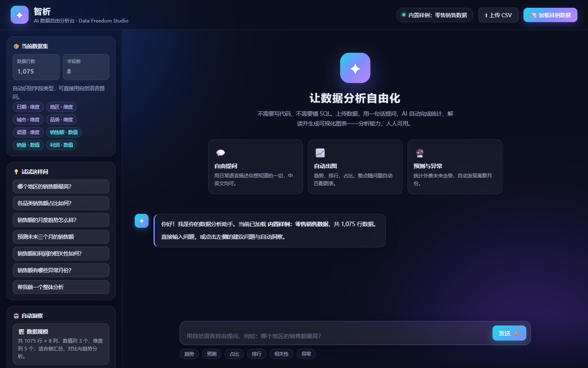
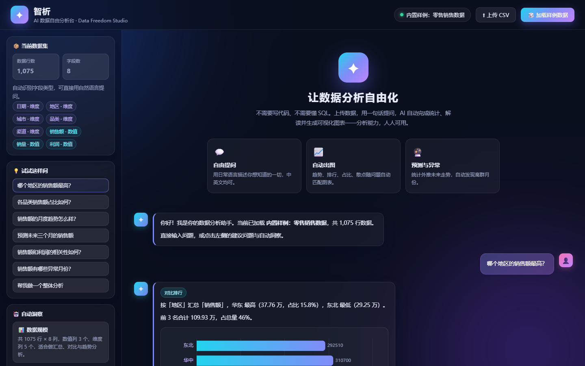

# 智析 · AI 数据自由分析台（Demo）

> 让数据分析自由化：不写代码、不问 SQL，用一句日常语言就能完成统计、解读与可视化。

这是一个基于数据分析的 **AI 自由化应用 Demo**。核心主张：把"分析师能力"下放给每个人——
用户上传数据后，可以用自然语言自由提问（中英文均可），AI 自动识别意图、执行真实统计计算、
生成结论并匹配最合适的图表；同时自动产出一份"数据体检报告"，主动给出值得深挖的洞察。



## 功能特性

| 能力 | 说明 |
| --- | --- |
| 💬 自由提问 | 中文/英文自然语言提问，无需懂任何分析语法 |
| 📈 趋势分析 | 按时间聚合销售额/销量/利润等指标，识别峰谷与整体涨跌 |
| 🏆 对比排行 | 各地区/品类/渠道等维度的 TOP 排行与头部集中度 |
| 🥧 占比分布 | 维度占比构成，评估结构是否均衡 |
| 🔗 相关性分析 | 任意两个数值指标的 Pearson 相关与散点拟合 |
| 🔮 预测外推 | 基于线性回归对未来 3 期做参考性预测 |
| ⚠️ 异常检测 | 按周期做 z-score 离群点检测，标注异常月份 |
| 📊 整体分析 | 核心指标卡 + 头部贡献 + 趋势判断 |
| 🤖 自动洞察 | 数据加载后自动扫描，输出数据规模/核心指标/TOP/关联/趋势等体检报告 |
| ⬆ 上传 CSV | 支持任意结构的 CSV（自动推断数值列与维度列），GBK/UTF-8 均可 |

## 快速开始

环境要求：Node.js 18+。

```bash
cd ai-data-freedom-demo
npm install                  # 安装依赖（express / multer / echarts）
npm run generate-sample      # 生成内置样例数据（1075 行零售订单）
npm start                    # 启动服务
```

浏览器打开 <http://localhost:3000>。服务启动时自动加载内置样例数据，也可点击「上传 CSV」加载自己的数据。
若本机存在 `.env` 并配置了大模型密钥，页面右上角会显示「🤖 已接入 <模型名>」，每次回答末尾追加一段 AI「自由解读」。



## 提问示例

- 哪个地区的销售额最高？
- 各品类销售额占比如何？
- 销售额的月度趋势怎么样？
- 预测未来三个月的销售额
- 销售额和利润的相关性如何？
- 销售额有哪些异常月份？
- 帮我做一个整体分析
- Show monthly sales trend（英文也可以）

## 技术架构

```
本地完整版（默认）：
  浏览器（Vanilla JS + ECharts 6）
        │  fetch / JSON
        ▼
  Express 服务端
    ├─ lib/csv.js       CSV 解析（引号/分隔符/类型推断/GBK 兜底）
    ├─ lib/stats.js     统计库（描述统计/聚合/Pearson/线性回归/z-score）
    ├─ lib/nlp.js       NL 分析引擎（意图识别→字段解析→计算→结论生成）
    ├─ lib/insights.js  自动洞察生成器
    └─ lib/llm.js       可选大模型接入（默认离线，规则引擎即可完整运行）

GitHub Pages 静态版（docs/）：
  浏览器直接运行同一套 lib/ 引擎，零后端依赖。
```

## 设计思路：从需求到交付

### 1. 需求定义：什么是"AI 自由化"

项目的起点是一个命题：**把数据分析从"专人专岗"变成"人人可用"**。"自由化"包含三层含义：

1. **提问自由**：不需要学 SQL、Python 或任何分析语法，用日常语言说出想知道的即可；
2. **数据自由**：任何结构的数据拿来就能分析，不预设表结构、不限制字段名；
3. **部署自由**：既能作为完整服务运行，也能打包成纯静态网页放在 GitHub Pages 上分享。

由此推导出核心交互模型——**聊天式分析**：提问 = 分析入口，回答 = 结论 + 图表，产品不需要"操作手册"。

### 2. 技术选型与双版本策略

| 决策 | 理由 |
| --- | --- |
| 自研规则引擎，而非直接套大模型 | 离线可完整演示、结论可复现、每个数字都有真实统计依据；大模型作为可选增强层 |
| 原生 JS + ECharts，不用 React/Vue/打包器 | 零构建、零依赖下载，静态版可直接被 GitHub Pages 托管 |
| Express 做服务端版 | 轻量、生态成熟，负责 CSV 上传与可选的大模型转发 |
| 双版本（`public/` 服务端版 + `docs/` 静态版） | GitHub Pages 只支持静态文件，分析引擎恰好是纯 JS，可整体搬到浏览器 |

```
┌── docs/ 静态版（GitHub Pages）────────────────────────┐
│  index.html + app.js → 浏览器内运行分析引擎           │
└──────────────────────────────────────────────────────┘
┌── public/ + server.js 本地完整版 ─────────────────────┐
│  浏览器前端 → Express API → 同一套引擎 → 可选大模型    │
└──────────────────────────────────────────────────────┘
        两版共用 lib/：csv / stats / nlp / insights
```

一次提问的数据流：

```
提问 → 规范化（去标点/转小写）→ 意图识别
     → 字段解析（指标 / 维度 / 时间列）
     → 统计计算 → 结论生成 → 图表映射 → 聊天流内渲染
```

### 3. 数据层设计

CSV 解析（`lib/csv.js`）解决"任意表格都能进来"的问题：

- **分隔符探测**：自动识别逗号、制表符、分号，兼容不同导出工具；
- **引号与转义**：处理字段内含逗号/换行/双引号的情况；
- **类型推断**：按"数值占比 > 80%"判定数值列，其余为维度列——这是字段解析和图表能力的基础；
- **编码兜底**：UTF-8 解析异常时回退 GBK（中文 Windows 导出的 Excel CSV 常见）。

### 4. 统计引擎设计

`lib/stats.js` 刻意保持"小而可信"：

- 描述统计（均值/中位数/标准差/分位数）用于整体概况；
- 分组聚合（sum/mean/count）支撑排行、占比、趋势；
- Pearson 相关系数 + 强度分档（r≥0.8 强相关等），用于关联分析；
- 线性回归外推 3 期，用于预测——刻意不做复杂时序模型：追求可解释、零依赖，结论中明确标注"仅供参考"；
- z-score（阈值 2.5）做周期异常检测，异常点以 pin 标注。

设计原则：**结论里的每个数字都来自真实计算，模型从不"编数"**。

### 5. 自然语言理解设计

`lib/nlp.js` 是一条可解释的规则管道：

1. **规范化**：去标点、转小写；
2. **意图识别**：关键词规则覆盖 7 类（趋势/预测/占比/排行/相关性/异常/整体），未命中时兜底到整体分析；
3. **字段解析**：指标同义词表（销售额=收入=营收=GMV…）、维度同义词表（品类=分类=产品…），列名自动匹配；
4. **时间感知**：自动发现时间列（列名或日期格式），并识别月/季度粒度；
5. **计算与生成**：按意图执行统计，用模板把真实数值组织成结论。

规则引擎擅长单轮、事实型提问；复杂多轮追问、开放式解读交给可选的大模型层。

### 6. 结论与图表生成

意图与图表的映射是产品体验的关键：

| 意图 | 图表 | 关键呈现细节 |
| --- | --- | --- |
| 趋势 | 平滑面积折线 | 峰谷高亮 |
| 预测 | 折线 + 虚线外推 | 预测区背景色 markArea |
| 排行 | 横向条形图 | 渐变填充 + 数值标签 |
| 占比 | 环形饼图 | 中心显示总量 |
| 相关性 | 散点 + 拟合线 | 标注 r 值 |
| 异常 | 折线 + pin 标记 | 异常点红标 |
| 整体 | 统计卡片 + 头部贡献 | 6 项核心指标 |

回答文本采用"结论先行、证据随后"的句式，例如趋势分析先给整体涨跌，再报峰谷与幅度。

### 7. 交互与视觉设计

- **聊天优先**：所有分析结果以内联消息呈现，图表不跳出新页面，保持"对话感"；
- **侧栏三件套**：数据集信息（行数/字段/类型）、建议问题（降低提问门槛）、自动洞察（主动引导深挖）；
- **视觉语言**：深色玻璃拟态 + 青→紫渐变主色，意图标签（📈🏆🥧…）让用户一眼看到 AI 做了什么；
- **细节打磨**：打字动画模拟思考节奏；聊天区与侧栏独立滚动（`min-height: 0` 修复 flex 撑高问题）；输入框 Enter 发送、Shift+Enter 换行。

### 8. 样例数据设计

为了让每个功能都有"戏"可演，样例数据内置了一套可控剧本：

- 24 个月零售订单（1075 行），固定随机种子保证可复现；
- 缓慢增长趋势 + 双 11/618 季节性高峰，让趋势与预测图有说服力；
- 注入一个真实异常（2024-03 华南家电峰值），让异常检测有明确结果；
- 利润与销售额强相关（r≈0.94），让相关性分析"有结论可讲"。

### 9. 大模型扩展与安全设计

采用**双引擎**：规则引擎负责"准确"，大模型负责"自由解读"（在统计结论之外追加业务建议）。

- 密钥只存在于本机 `.env`，`.gitignore` 排除，不进入仓库；
- 静态版（GitHub Pages）不接云端大模型——网页中的密钥等于公开，且浏览器直连存在跨域限制；
- 大模型调用设置超时与失败降级：任何异常都自动回退到规则引擎输出，不因外部依赖而不可用。

### 10. 部署设计

- **本地完整版**：`npm start`，Express 提供页面 + 分析 API + 可选大模型转发；
- **GitHub Pages 版**：`docs/` 内的静态站点，Pages 配置为发布 `/docs` 目录；
- 两者共用同一套引擎代码，行为一致，只是运行环境不同（Node vs 浏览器）。

### 11. 测试与质量保障

三层验证，全部自动化：

1. **API 层**：模拟 7 类提问，断言意图、图表类型与结论数值；
2. **浏览器 E2E**：`qa.js`（服务端版 18 项）、`qa-pages.js`（静态版 13 项）、`qa-file.js`（file:// 直开 5 项）；
3. **像素级断言**：检查 ECharts canvas 是否真实绘制（而非空白容器），并监听控制台错误。

开发中踩过的坑也被固化为测试：flex 布局滚动失效、file:// 跨域请求、LLM 慢响应导致的测试时序问题。

### 12. 局限与演进方向

- 规则引擎无法处理复杂多轮语义 → 由大模型层补足，可演进为"先统计、后对话"的 Agent；
- 数据源可扩展：Excel / JSON / 数据库直连；
- 输出可扩展：分析结果一键导出报告（Word/PPT）；
- 交互可扩展：图表点击下钻、筛选联动。

## 大模型接入（可选）

内置规则引擎保证 Demo **离线即可完整运行**；如需大模型"自由解读"，在项目根目录创建 `.env`：

```ini
LLM_API_KEY=sk-你的密钥
LLM_BASE_URL=https://api.deepseek.com   # 任意 OpenAI 兼容服务均可
LLM_MODEL=deepseek-v4-flash
```

配置后，每次回答会在统计结论之外追加一段 AI「自由解读」。调用失败时自动回退到内置引擎。

> 注意：`.env` 已被 `.gitignore` 排除，请勿将密钥提交到仓库。

## 目录结构

```
ai-data-freedom-demo/
├─ server.js               # Express 服务与 API
├─ lib/                    # 分析引擎（csv / stats / nlp / insights / llm）
├─ public/                 # 服务端版前端（index.html / css / js）
├─ scripts/                # 样例数据生成、本地预览、浏览器 QA
├─ data/sample.csv         # 内置样例数据（由脚本生成）
├─ docs/                   # GitHub Pages 静态版（含演示截图）
└─ .env.example            # 大模型配置示例（复制为 .env 使用）
```

## 测试

项目内置无头浏览器端到端检查：

```bash
npm run qa             # 服务端版 18 项断言
npm run preview:pages  # 本地预览静态版 -> http://localhost:8080
```

静态版 E2E：`node scripts/qa-pages.js`（13 项）；file:// 直开场景：`node scripts/qa-file.js`（5 项）。

## 部署到 GitHub Pages

`docs/` 静态版可直接部署：

1. 推送代码到 GitHub 仓库；
2. 仓库 Settings → Pages → Build and deployment → Source 选 **Deploy from a branch**；
3. Branch 选 `main`，目录选 **`/docs`**，保存；
4. 等待 1-2 分钟，访问 `https://<用户名>.github.io/<仓库名>/`。

> 说明：GitHub Pages 免费版要求仓库为 Public；静态版为纯浏览器计算，不调用云端大模型，上传的 CSV 仅在本机浏览器内处理。

## 后续可扩展方向

- 接入真实 LLM 后支持更开放的追问与多轮上下文
- 增加 Excel/JSON/数据库直连等更多数据源
- 支持自然语言生成分析报告（Word/PPT 导出）
- 图表交互下钻（点击柱子继续追问）
